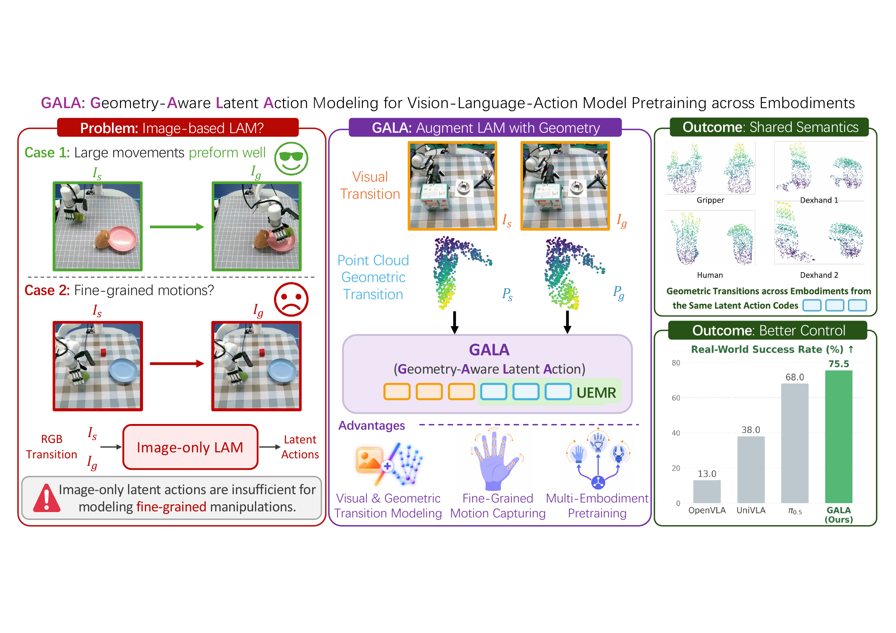

# GALA: Geometry-Aware Latent Action Modeling for Vision-Language-Action Model Pretraining across Embodiments

[](figure/Teaser.pdf)

Official repository for GALA: Geometry-Aware Latent Action Modeling for Vision-Language-Action Model Pretraining across Embodiments

[](https://puzhenyuan.github.io/GALA-website/) [](https://huggingface.co/ypz21/GALA_robocasa_gr1)

## Setup

Use Linux, Python 3.10, an NVIDIA GPU with CUDA 12.4 support, a CUDA build toolchain, and EGL for headless rendering.

```bash
git clone git@github.com:PuzhenYuan/GALA.git
cd GALA
conda create -n gala python=3.10 -y
conda activate gala
bash examples/environment_setup.sh
```

## Download checkpoints

```bash
hf auth login  # Use an account with access to this private model repository.
hf download ypz21/GALA_robocasa_gr1 --local-dir checkpoints/checkpoint_robocasa_gr1
hf download Qwen/Qwen2.5-VL-3B-Instruct --local-dir checkpoints/Qwen2.5-VL-3B-Instruct
```

## Evaluate

Run from the GALA repository root:

```bash
mkdir -p outputs
set -o pipefail
PYTHON_BIN="$(command -v python)" \
GALA_BACKBONE_PATH="$PWD/checkpoints/Qwen2.5-VL-3B-Instruct" \
GPU_IDS=0,1,2,3,4,5,6,7 \
PROCS_PER_GPU=3 \
PORT_BASE=5810 \
N_ENVS=1 \
N_EPISODES=50 \
EVAL_TAG=_gala_parallel \
DATA_CONFIG=fourier_gr1_arms_waist_gausNorm_crop_cam_ego_joints_only \
bash examples/run_eval_parallel.sh checkpoints/checkpoint_robocasa_gr1 id \
2>&1 | tee outputs/eval_gala_robocasa_gr1_id.log
```

This runs 24 ID tasks with 50 episodes each, using 8 GPUs and 3 workers per GPU. Results and videos are saved under `outputs/evaluation_sim_id_1envs_gala_parallel/`.

For a quick check, use `GPU_IDS=0`, `PROCS_PER_GPU=1`, `N_EPISODES=1`, `EVAL_MAX_TASKS=1`, and `EVAL_TAG=_smoke`. The checkpoint argument also accepts `ypz21/GALA_robocasa_gr1` directly. No training data or latent-encoder weights are required.

## Acknowledgement

GALA is built on top of [NVIDIA Isaac GR00T N1.5](https://github.com/NVIDIA/Isaac-GR00T/tree/n1.5-release) and [UniT](https://github.com/xpeng-robotics/UniT/). We thank the authors for their efforts!
